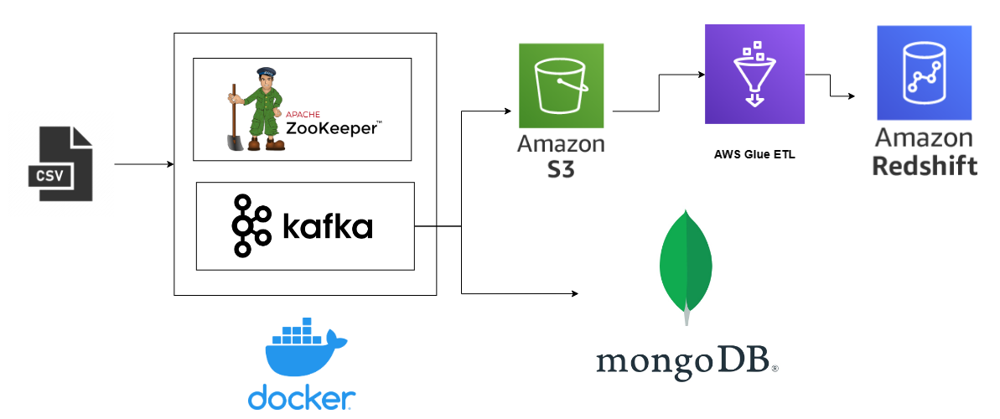

# BUF

## Description
BUF is a simple website for predicting stock price on three Vietnamese stock exchanges.

## Technology Stack
* LSTM (Long Short-Term Memory).
* Docker
* Kafka and Zookeeper
* Amazon Web Services (AWS): S3, Glue, Redshift
* MongoDB

## System Flow


## How to Use
### Run Docker Compose
First, run Docker Compose to set up the environment:
```bash
docker-compose up -d
```

### Install the dependencies
Then, open the terminal and run these commands
```bash
cd server
pip install requirements.txt
```

### Run Producer and Consumer
Next, you can run the Producer and Consumer (located in the **kafka** folder). You have the option to choose the target storage between "S3" (Amazon Simple Storage Service) or "MongoDB".

### Next Step
#### S3
If you choose S3, you will create a Redshift data warehouse from S3. Read this [link](https://github.com/sinemozturk/INCREMENTAL-DATA-LOADING-FROM-AWS-S3-BUCKET-TO-REDSHIFT-BY-USING-AWS-GLUE-ETL-JOB) for detail. I have tested it, but my budget was exhausted, so cosider your budget before following this route.

#### MongoDB
If you choose MongoDB, before running Producer and Consumer, create a cluster on Atlas and set up a database with three collections: HNX, HOSE, UPCOM

## Evaluation LSTM model
| Exchange   |   MSE     |  RMSE     |   MAPE    | R<sup>2</sup> Score |
| :----:     | :-------: | :-------: | :-------: | :-----------------: |
| HNX        | 2.8273    |  1.6815   |  0.3293   |  0.9804 |
| HOSE       | 6.7420    |  2.5965   |  0.2188   |  0.7874 |
| UPCOM      | 0.5977    |  0.7731   |  0.0329   |  0.9914 |

## APIs
Read file **main.py** for detail. I'm too lazy now :(

## Future Plan
* Buil an User Inteface for this project.
* Build some other functionalities.

<h3 style="text-align:center; font-size:30px">Chill coding!!!</h3>
